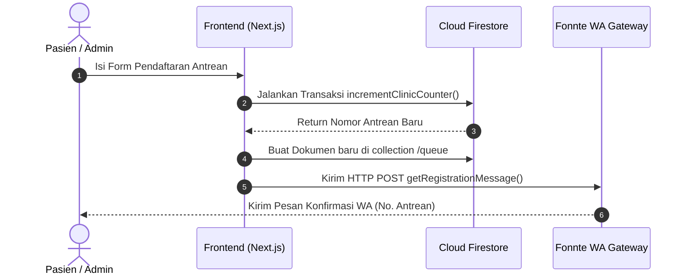
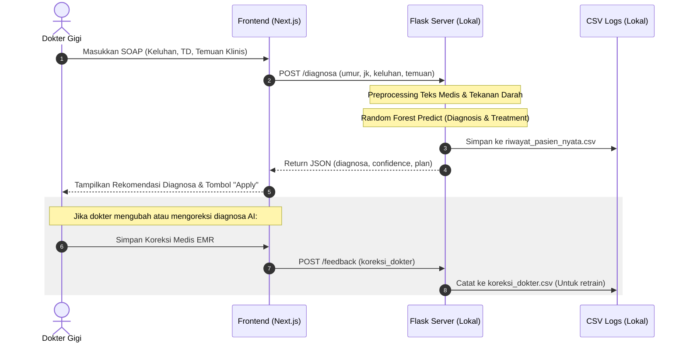

# Software Design Description (SDD)
## Sistem Manajemen Terpadu Klinik Gigi (Praktek Gigi Ranida)

---

## 1. Arsitektur Sistem (System Architecture)

Sistem dirancang menggunakan arsitektur **Hybrid Client-Server** dengan pembagian beban kerja yang jelas antara layanan cloud real-time (Firebase/Supabase) dan layanan kecerdasan buatan lokal (Flask AI Server).

```mermaid
graph TD
    subgraph Client Side (Klinik & Pasien)
        A[Next.js 15 / React 19 SPA] <--> B[Local Cache / Firestore Offline SDK]
    end

    subgraph External Cloud Services
        C[Firebase Authentication] <--> A
        D[Cloud Firestore Database] <--> A
        E[Supabase Storage - Visual Galeri] <--> A
        F[WhatsApp Gateway - Fonnte API] <--> A
    end

    subgraph Internal Local Network (Clinic Server)
        G[Flask Python API Server] <--> A
        H[Random Forest Model pkl] <--> G
        I[CSV Logging riwayat & koreksi] <--> G
    end
```

---

## 2. Aliran Data Utama (Data Flow Diagrams)

### 2.1. Pendaftaran Antrean & Pengiriman WhatsApp
Proses transaksional pendaftaran antrean hingga penyiapan data klinis pasien:



### 2.2. Diagnosa Cerdas Local AI & Feedback Medis
Proses dokter melakukan input EMR klinis, mendapatkan bantuan diagnosa AI secara lokal, dan mengoreksi hasil jika terjadi ketidaksesuaian:



---

## 3. Desain Database & Skema Data (Firestore)

Firestore beroperasi sebagai database NoSQL berbasis dokumen. Berikut adalah struktur dokumen utama yang diimplementasikan:

### 3.1. Collection: `/users`
Menyimpan profil pengguna yang memiliki akun di sistem untuk penentuan otorisasi (RBAC).
*   **Key**: `uid` (dari Firebase Auth)
*   **Fields**:
    ```typescript
    {
      uid: string;
      email: string | null;
      displayName: string | null;
      photoURL: string | null;
      role: 'admin' | 'doctor' | 'patient';
      createdAt: Timestamp;
      updatedAt?: Timestamp;
    }
    ```

### 3.2. Collection: `/patients`
Menyimpan data master rekam medis pasien jangka panjang.
*   **Key**: `phone` (nomor telepon pasien sebagai ID unik) atau ID acak.
*   **Fields**:
    ```typescript
    {
      id: string;
      name: string;
      phone: string;
      birthDate?: string; // Format YYYY-MM-DD
      address?: string;
      medicalHistory?: string; // Riwayat sistemik (Hipertensi, Diabetes)
      allergies?: string;
      gender?: 'L' | 'P';
      bloodType?: string;
      lastVisit?: string;
      createdAt: Timestamp;
    }
    ```

### 3.3. Collection: `/queue`
Menyimpan riwayat antrean harian dan EMR kunjungan spesifik (SOAP, Odontogram).
*   **Key**: `id` (Auto-generated Firestore)
*   **Fields**:
    ```typescript
    {
      id: string;
      name: string;
      phone: string;
      complaint: string;
      status: 'WAITING' | 'TREATING' | 'PAID' | 'FINISHED' | 'CALLING' | 'SKIPPED';
      number: string; // Nomor antrean (misal: "005")
      date: string; // Format YYYY-MM-DD
      time: string; // Format HH:MM
      billingAmount?: number;
      treatment?: string;
      notes?: string;
      createdAt: Timestamp;
      updatedAt: Timestamp;
      
      // Clinical SOAP
      subjective?: string;
      objective?: string;
      vitals?: {
        bloodPressure?: string;
        heartRate?: string;
        respiratoryRate?: string;
        temperature?: string;
        painScale?: string;
      };
      intraOral?: {
        mucosa?: string;
        gingiva?: string;
        palatum?: string;
        tongue?: string;
        tonsils?: string;
        other?: string;
      };
      assessmentDescription?: string; // Diagnosa dokter
      assessmentIcd10?: string;       // Kode ICD-10
      plan?: string;                  // Rencana tindakan dokter
      soapTeeth?: string;             // Gigi spesifik yang diobati (misal: "18, 36")
    }
    ```

---

## 4. Spesifikasi API Server AI Lokal (Python Flask)

Flask API Server berjalan di lingkungan lokal klinik (default: `http://127.0.0.1:5000`) dan melayani request tanpa membutuhkan akses internet eksternal.

### 4.1. Endpoint: `POST /diagnosa`
Digunakan oleh frontend untuk memprediksi diagnosa kerja dan rencana perawatan berdasarkan input klinis dokter.

*   **Request Headers**: `Content-Type: application/json`
*   **Request Body**:
    ```json
    {
      "umur": 34,
      "jenis_kelamin": "L",
      "tekanan_darah": "130/80",
      "keluhan": "Gigi bawah belakang kanan ngilu sekali sejak 2 hari lalu saat minum air dingin",
      "temuan": "Terdapat karies profunda pada gigi 46 oklusal kavitas terbuka"
    }
    ```
*   **Response Body (Success 200 OK)**:
    ```json
    {
      "status": "success",
      "diagnosa": "Pulpitis Reversibel",
      "confidence": "87.50%",
      "plan": "Restorasi Komposit Gigi 46",
      "provider": "Ranida Local Engine (Pro)"
    }
    ```
*   **Error Handling (503 Service Unavailable)**: Jika file model `model_ai_gigi_pro.pkl` gagal diload.
    ```json
    {
      "status": "error",
      "message": "Sistem AI sedang dalam pemeliharaan. Silakan hubungi admin."
    }
    ```

### 4.2. Endpoint: `POST /feedback`
Digunakan untuk merekam koreksi ahli (dokter gigi) terhadap prediksi AI yang kurang akurat. Data ini digunakan untuk melatih ulang (*retraining*) model AI secara berkala.

*   **Request Body**:
    ```json
    {
      "umur": 34,
      "jenis_kelamin": "L",
      "tekanan_darah": "130/80",
      "keluhan": "Gigi bawah belakang kanan ngilu sekali sejak 2 hari lalu saat minum air dingin",
      "temuan": "Terdapat karies profunda pada gigi 46 oklusal kavitas terbuka",
      "diagnosa_ai": "Karies Dentin",
      "diagnosa_benar": "Pulpitis Reversibel",
      "perawatan_benar": "Restorasi Komposit Gigi 46"
    }
    ```
*   **Response Body**:
    ```json
    {
      "status": "success",
      "message": "Terima kasih! Koreksi Anda telah disimpan untuk melatih AI menjadi lebih pintar."
    }
    ```

---

## 5. Implementasi Keamanan & Offline-First

### 5.1. Offline-First via Firestore SDK
Sistem dikonfigurasi menggunakan persistence local cache Firestore:
*   Saat browser dokter kehilangan internet, semua aksi penyimpanan EMR SOAP akan ditulis ke database lokal di indexedDB browser.
*   Komponen antrean real-time melacak perubahan lokal secara instan.
*   Begitu koneksi internet tersambung kembali, Firestore SDK secara otomatis mengirimkan pembaruan lokal (antrean *FINISHED*, odontogram terupdate) ke cloud server secara transaksional tanpa memerlukan intervensi manual dari pengguna.

### 5.2. Perlindungan Privasi Data Medis (HIPAA)
*   **Zero Leakage AI Policy**: Proses klasifikasi Random Forest tidak menggunakan model LLM pihak ketiga (seperti GPT/Gemini API) untuk menghindari transmisi detail keluhan dan identitas pasien ke internet.
*   Proses *Preprocessing* teks dilakukan di level lokal menggunakan pustaka Python `scikit-learn` dengan konversi TF-IDF terenkapsulasi secara lokal.
